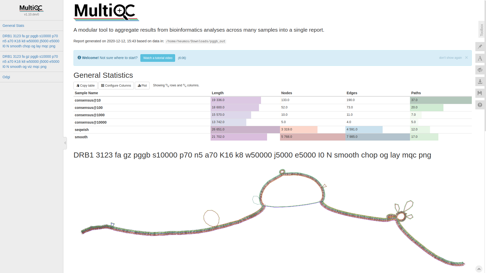

<a href="https://github.com/pangenome/pggb/tree/master/logo"></a>

# pggb: the PanGenome Graph Builder


[//]: # ([![install with bioconda]&#40;https://img.shields.io/badge/install%20with-bioconda-brightgreen.svg?style=flat&#41;]&#40;https://anaconda.org/bioconda/pggb&#41;)

`pggb` builds [pangenome](https://doi.org/10.1146%2Fannurev-genom-120219-080406) [variation graphs](https://doi.org/10.1038/nbt.4227) from a set of input sequences.

A pangenome variation graph is a kind of generic multiple sequence alignment.
It lets us understand any kind of sequence variation between a collection of genomes.
It shows us similarity where genomes walk through the same parts of the graph, and differences where they do not.

`pggb` generates this kind of graph using an all-to-all alignment of input sequences ([wfmash](https://github.com/waveygang/wfmash)), graph induction ([seqwish](https://doi.org/10.1101/2022.02.14.480413)), and progressive normalization ([smoothxg](https://github.com/pangenome/smoothxg), [gfaffix](https://github.com/marschall-lab/GFAffix)).
After construction, `pggb` generates diagnostic visualizations of the graph ([odgi](https://doi.org/10.1093/bioinformatics/btac308)).
A variant call report (in VCF) representing both small and large variants can be generated based on any reference genome included in the graph ([vg](https://github.com/vgteam/vg)).
`pggb` writes its output in [GFAv1](https://github.com/GFA-spec/GFA-spec/blob/master/GFA1.md) format, which can be used as input by numerous "genome graph" and pangenome tools, such as the [vg](https://github.com/vgteam/vg) and [odgi](https://doi.org/10.1093/bioinformatics/btac308) toolkits.

`pggb` has been tested at scale in the Human Pangenome Reference Consortium (HPRC) as a method to build a graph from the [draft human pangenome](https://doi.org/10.1101/2022.07.09.499321).

Documentation at [https://pggb.readthedocs.io/](https://pggb.readthedocs.io/) and [pggb manuscript](https://github.com/pangenome/pggb-paper) (WIP).

## quick start

1) Install `pggb` with [Docker](https://github.com/pangenome/pggb#docker), [Singularity](https://github.com/pangenome/pggb#singularity), [bioconda](https://github.com/pangenome/pggb#bioconda), [guix](https://github.com/pangenome/pggb#guix), or by [manually building its dependencies](https://github.com/pangenome/pggb#manual-mode).

2) Put your sequences in one FASTA file (`in.fa`), optionally compress it with `bgzip`, and index it with `samtools faidx`.
If you have many samples and/or haplotypes, we recommend using the [PanSN prefix naming pattern](https://github.com/pangenome/PanSN-spec).

3) [*OPTIONAL*] If you have whole-genome assemblies, you might consider partitioning your sequences into communities, which usually correspond to the different chromosomes of the genomes.
Then, you can run `pggb` on each community (set of sequences) independently (see [partition before pggb](#partition-before-pggb)).

4) To build a graph from `in.fa`, which contains, for example, 9 haplotypes, in the directory `output`, scaffolding the graph using 5kb matches at >= 90% identity, and using 16 parallel threads for processing, execute:

```bash
pggb -i in.fa \       # input file in FASTA format
     -o output \      # output directory
     -n 9 \           # number of haplotypes (optional with PanSN-spec)
     -t 16 \          # number of threads
     -p 90 \          # minimum average nucleotide identity for segments
     -s 5k \          # segment length for scaffolding the graph
     -V 'ref:1000'    # make a VCF against "ref" decomposing variants <= 1000bp
```

The final output will match `outdir/in.fa.*final.gfa`.
By default, we render 1D and 2D visualizations of the graph with [odgi](https://doi.org/10.1093/bioinformatics/btac308), which are very useful to understand the result of the build.

See also [this step-by-step example](https://pggb.readthedocs.io/en/latest/rst/quick_start.html) for more information.

### partition before pggb

In the above example, to partition your sequences into communities, execute:

```bash
partition-before-pggb -i in.fa \       # input file in FASTA format
                      -o output \      # output directory
                      -n 9 \           # number of haplotypes (optional with PanSN-spec)
                      -t 16 \          # number of threads
                      -p 90 \          # minimum average nucleotide identity for segments
                      -s 5k \          # segment length for scaffolding the graph
                      -V 'ref:1000'    # make a VCF against "ref" decomposing variants <= 1000bp
```

This generates the command lines to run `pggb` on each community (2 in this example) independently:

```shell
pggb -i output/in.fa.dd9e519.community.0.fa \
     -o output/in.fa.dd9e519.community.0.fa.out \
     -p 5k -l 25000 -p 90 -n 9 -K 19 -F 0.001 \
     -k 19 -f 0 -B 10000000 \
     -H 9 -j 0 -e 0 -G 700,900,1100 -P 1,19,39,3,81,1 -O 0.001 -d 100 -Q Consensus_ \
     -V ref:1000 --threads 16 --poa-threads 16
pggb -i output/in.fa.dd9e519.community.1.fa \
     -o output/in.fa.dd9e519.community.1.fa.out \
     -p 5k -l 25000 -p 90 -n 9 -K 19 -F 0.001 \
     -k 19 -f 0 -B 10000000 \
     -H 9 -j 0 -e 0 -G 700,900,1100 -P 1,19,39,3,81,1 -O 0.001 -d 100 -Q Consensus_ \
     -V ref:1000 --threads 16 --poa-threads 16
```

Se also the [sequence partitioning](https://pggb.readthedocs.io/en/latest/rst/tutorials/sequence_partitioning.html) tutorial for more information

## citation

Erik Garrison*, Andrea Guarracino*, Simon Heumos, Flavia Villani, Zhigui Bao, Lorenzo Tattini, Jörg Hagmann, Sebastian Vorbrugg, Santiago Marco-Sola, Christian Kubica, David G. Ashbrook, Kaisa Thorell, Rachel L. Rusholme-Pilcher, Gianni Liti, Emilio Rudbeck, Sven Nahnsen, Zuyu Yang, Mwaniki N. Moses, Franklin L. Nobrega, Yi Wu, Hao Chen, Joep de Ligt, Peter H. Sudmant, Nicole Soranzo, Vincenza Colonna, Robert W. Williams, Pjotr Prins, [Building pangenome graphs](https://doi.org/10.1101/2023.04.05.535718), bioRxiv 2023.04.05.535718; doi: https://doi.org/10.1101/2023.04.05.535718

## usage

Pangenome graphs let us understand multi-way relationships between many genomes.
They are thus models of many-way sequence alignments.
A goal of `pggb` is to reduce the complexity of making these alignments, which are notoriously [difficult to design](https://doi.org/10.1101%2Fgr.174920.114).

### key parameters

The overall structure of `pggb`'s output graph is defined by two parameters: segment length (`-s`) and pairwise identity (`-p`).
Segment length defines the seed length used by the "MashMap3" homology mapper in `wfmash`.
The pairwise identity is the minimum allowed pairwise identity between seeds, which is estimated using a mash-type approximation based on k-mer Jaccard.
Mappings are initiated from collinear chains of around 5 seeds (`-l, --block-length`), and extended greedily as far as possible, allowing up to `-n` minus 1 mappings at each query position. Genome number (`-n`) is automatically computed if sequence names follow [PanSN-spec](https://github.com/pangenome/PanSN-spec).

An additional parameter, `-k`, can also greatly affect graph structure by pruning matches shorter than a given threshold from the initial graph model.
In effect, `-k N` removes any match shorter than `N`bp from the initial alignment.
This filter removes potentially ambiguous pairwise alignments from consideration in establishing the initial scaffold of the graph.

The initial graph is defined by parameters to `wfmash` and `seqwish`.
But due to the ambiguities generated across the many pairwise alignments we use as input, this graph can be locally very complex.
To regularize it we orchestrate a series of graph transformations.
First, with `smoothxg`, we "smooth" it by locally realigning sequences to each other with a traditional multiple sequence alignment (we specifically apply [POA](https://doi.org/10.1093/bioinformatics/18.3.452)).
This process repeats multiple times to smooth over any boundary effects that may occur due to binning errors near MSA boundaries.
Finally, we apply `gfaffix` to remove forks where both alternatives have the same sequence.

### bringing your pangenome into focus

We suggest using default parameters for initial tests.
For instance `pggb -i in.fa.gz -o out ` would be a minimal build command for a pangenome from `in.fa.gz`.
The default parameters provide a good balance between runtime and graph quality for small-to-medium (1kbp-100Mbp) problems.

However, we find that parameters may still need to be adjusted to fine-tune `pggb` to a given problem.
Furthermore, it is a good idea to explore a range of settings of the pipeline's key graph-shaping parameters (`-s`, `-p`, `-k`) to appreciate the degree to which changes in parameters may or may-not affect results.
These parameters must be tuned so that the graph resolves structures of interest (variants and homologies) that are implied by the sequence space of the pangenome.

### example builds for diverse species

In preparation of a manuscript on `pggb`, we have developed a [set of example pangenome builds for a collection of diverse species](https://github.com/pangenome/pggb-paper/blob/main/workflows/AllSpecies.md#all-species).
(These also use cross-validation against [`nucmer`](https://mummer4.github.io/) to evaluate graph quality.)

Examples (`-n` is optional if sequence names follow [PanSN-spec](https://github.com/pangenome/PanSN-spec)):

- Human, whole genome, 90 haplotypes: `pggb -p 98 -s 10k -k 47 [-n 90]...`
- 15 helicobacter genomes, 5% divergence: `pggb -k 47 [-n 15]`, and 15 at higher (10%) divergence `pggb -k 23 [-n 15] ...`
- Yeast genomes, 5% divergence: `pggb`'s defaults should work well.
- Aligning 9 MHC class II assemblies from vertebrate genomes (5-10% divergence): `pggb -k 29 [-n 9] ...`
- A few thousand bacterial genomes `pggb -x auto [-n 2000] ...`. In general mapping sparsification (`-x auto`) is a good idea when you have many hundreds to thousands of genomes.

`pggb` defaults to using the number of threads as logical processors on the system (the thread count given by `getconf _NPROCESSORS_ONLN`).
Use `-t` to set an appropriate level of parallelism if you can't use all the processors on your system.

## visual diagnostics

To guide graph building, `pggb` provides several visual diagnostic outputs.
Here, we explain them using a test from the [`data/HLA`](https://github.com/pangenome/pggb/tree/master/data/HLA) directory in this repo:

```bash
git clone --recursive https://github.com/pangenome/pggb
cd pggb
./pggb -i data/HLA/DRB1-3123.fa.gz -p 70 -s 500 -n 10 -t 16 -V 'gi|568815561' -o out -M
```

This yields a variation graph in GFA format, a multiple sequence alignment in MAF format (`-M`), and several diagnostic images (all in the directory `out/`). We specify `-n` because the sequences do not follow [PanSN-spec](https://github.com/pangenome/PanSN-spec), so the number of haplotypes can not be automatically computed.
We also call variants with `-V` with respect to the reference `gi|568815561`.

### 1D graph visualization


- The graph nodes’ are arranged from left to right forming the pangenome’s sequence.
- The colored bars represent the binned, linearized renderings of the embedded paths versus this pangenome sequence in a binary matrix.
- The black lines under the paths, so called links, represent the topology of the graph.

### 2D graph visualization


- Each colored rectangle represents a node of a path. The node’s x-coordinates are on the x-axis and the y-coordinates are on the y-axis, respectively.
- A bubble indicates that here some paths have a diverging sequence or it can represent a repeat region.

## extension

The pipeline is provided as a single script with configurable command-line options.
Users should consider taking this script as a starting point for their own pangenome project.
For instance, you might consider swapping out `wfmash` with `minimap2` or another PAF-producing long-read aligner.
If the graph is small, it might also be possible to use `abPOA` or `spoa` to generate it directly.
On the other hand, maybe you're starting with an assembly overlap graph which can be converted to blunt-ended GFA using [gimbricate](https://github.com/ekg/gimbricate).
You might have a validation process based on alignment of sequences to the graph, which should be added at the end of the process.

## downstream

The resulting graph can then be manipulated with [odgi](https://doi.org/10.1093/bioinformatics/btac308) for transformation, analysis, simplification, validation, interrogation, and visualization.
It can also be loaded into any of the GFA-based mapping tools, including [vg](https://github.com/vgteam/vg) `map`, `mpmap`, `giraffe`, and [GraphAligner](https://github.com/maickrau/GraphAligner).
Alignments to the graph can be used to make variant calls (`vg call`) and coverage vectors over the pangenome, which can be useful for phylogeny and association analyses.
Using `odgi matrix`, we can render the graph in a sparse matrix format suitable for direct use in a variety of statistical frameworks, including phylogenetic tree construction, PCA, or association studies.

## scalability

`pggb`'s initial use is as a mechanism to generate variation graphs from the contig sets produced by the human pangenome project.
Although its design represents efforts to scale these approaches to collections of many human genomes, it is not intended to be human-specific.

## principles

### pangenome alignment

It's straightforward to generate a pangenome graph by the all-pairs alignment of a set of input sequences.
And it's good: this provides a completely _unbiased_ view of the pangenome.
However, all-to-all alignment scales very poorly, with the square of the number of sequences, making it untenable for even small collections of genomes (~10s).
To make matters worse, existing standards for alignment are based on k-mer matching, which can require processing enormous numbers of seeds when aligning repetitive sequences.

We answer this new alignment issue with the mashmap and WFA-based algorithms in `wfmash`.
`wfmash` provides a practical way to generate alignments between the sequences.
Its design focuses on the long, collinear homologies that are often "orthologous" in a phylogenetic context.
Crucially, `wfmash` is robust to repetitive sequences, and it can be adjusted using probabilistic thresholds for segment alignment identity.
Finally, `seqwish` converts the alignments directly into a graph model.
This allows us to define the base graph structure using a few free parameters, as discussed above.

### graph normalization

The manifold nature of typical variation graphs means that they are very likely to look linear locally.
By running a stochastic 1D layout algorithm that attempts to match graph distances (as given by paths) between nodes and
their distances in the layout, we execute a kind of multi-dimensional scaling (MDS). In the aggregate, we see that
regions that are linear (the chains of nodes and bubbles) in the graph tend to co-localize in the 1D sort.
Applying an MSA algorithm (in this case, `abPOA` or `spoa`) to each of these chunks enforces a local linearity and
homogenizes the alignment representation. This smoothing step thus yields a graph that is locally as we expect: partially
ordered, and linear as the base DNA molecules are, but globally can represent large structural variation. The homogenization
also rectifies issues with the initial wfa-based alignment.

## installation

### manual-mode

You'll need `wfmash`, `seqwish`, `smoothxg`, `odgi`, and `gfaffix` in your shell's `PATH`.
These can be individually built and installed.
Then, put the `pggb` bash script in your path to complete installation.
Optionally, install `bcftools`, `vcfbub`, `vcfwave`, and `vg` for calling and normalizing variants, `MultiQC` for generating summarized statistics in a MultiQC report, or `pigz` to compress the output files of the pipeline.

### Docker

To simplify installation and versioning, we have an automated GitHub action that pushes the current docker build to the GitHub registry.
To use it, first pull the actual image (**IMPORTANT**: see also how to [build docker locally](#build-docker-locally)):

```bash
docker pull ghcr.io/pangenome/pggb:latest
```

Or if you want to pull a specific snapshot from [https://github.com/orgs/pangenome/packages/container/package/pggb](https://github.com/orgs/pangenome/packages/container/package/pggb):

```bash
docker pull ghcr.io/pangenome/pggb:TAG
```

You can pull the docker image also from [dockerhub](https://hub.docker.com/r/pangenome/pggb):

```bash
docker pull pangenome/pggb
```

As an example, going in the `pggb` directory

```bash
git clone --recursive https://github.com/pangenome/pggb.git
cd pggb
```

you can run the container using the [human leukocyte antigen (HLA) data](data/HLA) provided in this repo:

```bash
docker run -it -v ${PWD}/data/:/data ghcr.io/pangenome/pggb:latest /bin/bash -c "pggb -i /data/HLA/DRB1-3123.fa.gz -p 70 -s 3000 -n 10 -t 16 -V 'gi|568815561' -o /data/out"
```

The `-v` argument of `docker run` always expects a full path.
**If you intended to pass a host directory, use absolute path.**
This is taken care of by using `${PWD}`.

#### build docker locally

Multiple `pggb`'s tools use SIMD instructions that require AVX (like `abPOA`) or need it to improve performance.
The currently built docker image has `-Ofast -march=sandybridge` set.
This means that the docker image can run on processors that support AVX or later, improving portability, but preventing your system hardware from being fully exploited. In practice, this could mean that specific tools are up to 9 times slower. And that a pipeline runs ~30% slower compared to when using a native build docker image.

To achieve better performance, it is **STRONGLY RECOMMENDED** to build the docker image locally after replacing `-march=sandybridge` with `-march=native` and the `Generic` build type with `Release` in the `Dockerfile`:

```bash
sed -i 's/-march=sandybridge/-march=native/g' Dockerfile 
sed -i 's/Generic/Release/g' Dockerfile 
```

To build a docker image locally using the `Dockerfile`, execute:

```bash
docker build --target binary -t ${USER}/pggb:latest .
```

Staying in the `pggb` directory, we can run `pggb` with the locally built image:

```bash
docker run -it -v ${PWD}/data/:/data ${USER}/pggb /bin/bash -c "pggb -i /data/HLA/DRB1-3123.fa.gz -p 70 -s 3000 -n 10 -t 16 -V 'gi|568815561' -o /data/out"
```
A script that handles the whole building process automatically can be found at https://github.com/nf-core/pangenome#building-a-native-container.

### Singularity

Many managed HPCs utilize Singularity as a secure alternative to docker.
Fortunately, docker images can be run through Singularity seamlessly.

First pull the docker file and create a Singularity SIF image from the dockerfile.
This might take a few minutes.

```bash
singularity pull docker://ghcr.io/pangenome/pggb:latest
```

Next clone the `pggb` repo and `cd` into it

```bash
git clone --recursive https://github.com/pangenome/pggb.git
cd pggb
```

Finally, run `pggb` from the Singularity image.
For Singularity, to be able to read and write files to a directory on the host operating system, we need to 'bind' that directory using the `-B` option and pass the `pggb` command as an argument.

```bash
singularity run -B ${PWD}/data:/data ../pggb_latest.sif pggb -i /data/HLA/DRB1-3123.fa.gz -p 70 -s 3000 -n 10 -t 16 -V 'gi|568815561' -o /data/out
```

A script that handles the whole building process automatically can be found at https://github.com/nf-core/pangenome#building-a-native-container.

### Bioconda (VCF NORMALIZATON IS CURRENTLY MISSING, SEE [THIS ISSUE](https://github.com/pangenome/pggb/issues/312))

`pggb` recipes for Bioconda are available at https://anaconda.org/bioconda/pggb.
To install the latest version using `Conda` execute:

```bash
conda install -c bioconda pggb
```

If you get dependencies problems, try:

```bash
conda install -c bioconda -c conda-forge pggb
```

### guix

```bash
git clone https://github.com/ekg/guix-genomics
cd guix-genomics
GUIX_PACKAGE_PATH=. guix package -i pggb
```

### nextflow

A nextflow DSL2 port of `pggb` is developed by the [nf-core](https://nf-co.re/) community. See [nf-core/pangenome](https://github.com/nf-core/pangenome) for more details.


## reporting

### MultiQC

Many thanks go to [@Zethson](https://github.com/zethson) and [@Imipenem](https://github.com/Imipenem) who started to implemented a MultiQC module for `odgi stats`. Using `-m, --multiqc` statistics are generated automatically, and summarized in a MultiQC report. If created, visualizations and layouts are integrated into the report, too. In the following an example excerpt:



#### installation

```bash
pip install multiqc --user
```

The docker image already contains v1.11 of `MultiQC`.

## authors

Erik Garrison*, Andrea Guarracino*, Simon Heumos, Flavia Villani, Zhigui Bao, Lorenzo Tattini, Jörg Hagmann, Sebastian Vorbrugg, Santiago Marco-Sola, Christian Kubica, David G. Ashbrook, Kaisa Thorell, Rachel L. Rusholme-Pilcher, Gianni Liti, Emilio Rudbeck, Sven Nahnsen, Zuyu Yang, Mwaniki N. Moses, Franklin L. Nobrega, Yi Wu, Hao Chen, Joep de Ligt, Peter H. Sudmant, Nicole Soranzo, Vincenza Colonna, Robert W. Williams, Pjotr Prins, Building pangenome graphs, bioRxiv 2023.04.05.535718; doi: https://doi.org/10.1101/2023.04.05.535718

## license

MIT
