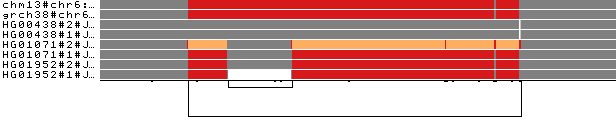

.. meta::
   :description: pggb: the pangenome graph builder
   :keywords: variation graph, pangenome graph

==================================
Welcome to the PGGB documentation!
==================================

In standard genomic approaches sequences are related to a single linear reference genome introducing reference bias.
`Pangenome graphs <https://pangenome.github.io/>`__ encoded in the variation graph data model describe the all versus all alignment of many sequences.

`pggb <https://github.com/pangenome/pggb>`_ renders a collection of sequences into a pangenome graph, in the variation graph model.
Its goal is to build a graph that is locally directed and acyclic while preserving large-scale variation.
Maintaining local linearity is important for the interpretation, visualization, and reuse of pangenome variation graphs.

``pggb`` consists of three phases:

  1. **sequence alignment**: `wfmash <https://github.com/ekg/wfmash>`_ uses a modified version of mashmap to obtain approximate mappings, and then applies a `wavefront-guided global alignment algorithm for long sequences <https://github.com/ekg/wflign>`_ to derive an alignment for each mapping. `wfmash` uses the `wavefront alignment algorithm <https://github.com/smarco/WFA>`_ for base-level alignment. This mapper is used to scaffold the pangenome, using genome segments of a given length with a specified maximum level of sequence divergence. All segments in the input are mapped to all others. This step yields alignments represented in the `PAF <https://github.com/lh3/miniasm/blob/master/PAF.md>`_ output format, with cigars describing their base-exact alignment.
  2. **graph induction**: with `seqwish <https://github.com/ekg/seqwish>`_, the induction process implicitly builds the `alignment graph <https://github.com/pangenome/pggb#:~:text=The%20pangenome%20graph%20is,variation%2Dgraph%2Dbased%20tools.>`_ in a memory-efficient disk-backed implicit interval tree. It then computes the transitive closure of the bases in the input sequences through the alignments. By tracing the paths of the input sequences through the graph, it produces a variation graph, which it emits in the restricted subset of `GFAv1 <https://github.com/GFA-spec/GFA-spec/blob/master/GFA1.md>`_ format used by variation-graph-based tools.
  3. **graph normalization**: with `smoothxg <https://github.com/pangenome/smoothxg>`_,  the graph is then sorted with a form of multi-dimensional scaling in 1D, groomed, and topologically ordered locally. The 1D order is then broken into "blocks" which are "smoothed" using the partial order alignment (POA) algorithm implemented in `abPOA <https://github.com/yangao07/abPOA>`_ or `spoa <https://github.com/rvaser/spoa>`_. This normalizes their mutual alignment and removes artifacts resulting from transitive ambiguities in the pairwise alignments. It ensures that the graph always has local partial order, which is essential for many applications and matches our prior expectations about small-scale variation in genomes. This step yields a rebuilt graph, a consensus subgraph, and a whole genome alignment in `MAF <http://www.bx.psu.edu/~dcking/man/maf.xhtml>`_ format.

Moreover, the pipeline supports identification and collapse of redundant structure with `GFAffix <https://github.com/marschall-lab/GFAffix>`_.
Optional post-processing steps  with `ODGI <https://github.com/pangenome/odgi>`_ provide 1D and 2D diagnostic visualizations of the graph and basic graph metrics.
Variant calling is also possible with `vg <https://github.com/vgteam/vg>`_ ``deconstruct`` to obtain a VCF file relative to any set of reference sequences used in the construction.
It utilizes a `path jaccard concept <https://github.com/vgteam/vg/pull/3416>`_ to correctly localize variants in segmental duplications and variable number tandem repeats.
In the HPRC data, this greatly improved variant calling performance.

The output graph (``*.smooth.fix.gfa``) is suitable for read mapping in `vg <https://github.com/vgteam/vg>`_ or with `GraphAligner <https://github.com/maickrau/GraphAligner>`_.

A Nextflow version of ``pggb`` is currently developed on `nf-core/pangenome <https://github.com/nf-core/pangenome>`_.
This pipeline presents an implementation that scales better on a cluster.

.. toctree::
    :maxdepth: 1
    :hidden:

    Welcome <self>
    rst/installation
    rst/quick_start
    rst/tutorials
    rst/faqs

Citation
--------

| **IN PREPARATION**

Core Functionalities
--------------------

**Click on the images below for more details.**

.. list-table::
    :widths: 40 60
    :align: center

    * - |tutorial_one|
      - **Tutorial one**

        + Step 1
        + Step 2
        + Step 3

------
Index
------

* :ref:`genindex`
* :ref:`search`
