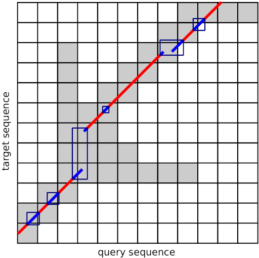
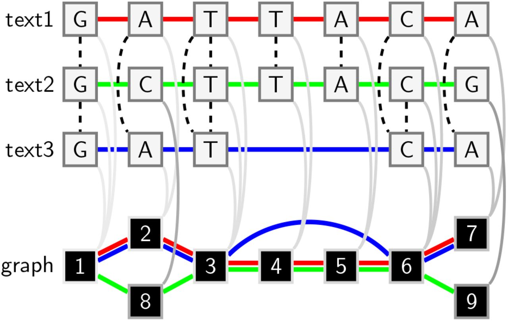
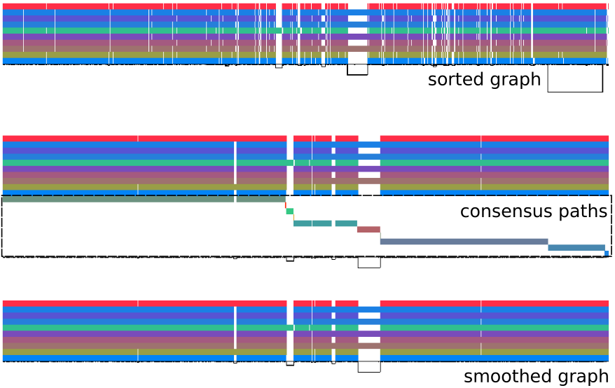
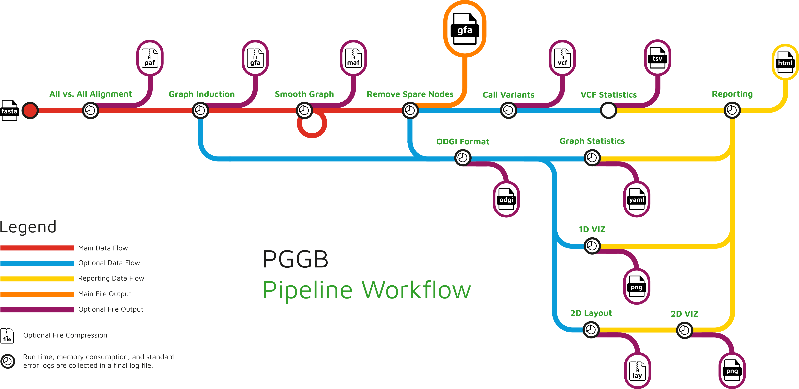

.. meta::
   :description: pggb: the pangenome graph builder
   :keywords: variation graph, pangenome graph

==================================
Welcome to the PGGB world!
==================================

In standard genomic approaches sequences are related to a single linear reference genome introducing reference bias.
`Pangenome graphs <https://pangenome.github.io/>`__ encoded in the variation graph data model describe the all versus all alignment of many sequences.

`pggb <https://github.com/pangenome/pggb>`_ renders a collection of sequences into a pangenome graph, in the variation graph model.
Its goal is to build a graph that is locally directed and acyclic while preserving large-scale variation.
Maintaining local linearity is important for the interpretation, visualization, and reuse of pangenome variation graphs.

Core packages
=============

.. list-table::
    :widths: 100 100
    :align: center

    * - |wfmash|
      - **Pairwise sequence alignment with** `wfmash <https://github.com/waveygang/wfmash>`_

        + `mashmap <https://github.com/marbl/MashMap>`_ variant for approximate mappings
        + `wavefront-guided <https://github.com/ekg/wflign>`_ global alignment for long secs
        + `wavefront <https://github.com/smarco/WFA2-lib>`_ algorithm for base-level alignment
        + Pairwise alignments in `PAF <https://github.com/lh3/miniasm/blob/master/PAF.md>`_ format

    * - |seqwish|
      - **Graph induction with** `seqwish <https://github.com/ekg/seqwish>`_

        + Build alignment graph with interval tress
        + Compute transitive closure of bases 
        + Path tracing yields variation graph
        + Raw pangenome graph in `GFAv1 <https://github.com/GFA-spec/GFA-spec/blob/master/GFA1.md>`_ format

    * - |smoothxg|
      - **Graph normalization with** `smoothxg <https://github.com/pangenome/smoothxg>`_

        + Global graph sorting with `PG-SGD <https://odgi.readthedocs.io/en/latest/rst/tutorials/sort_layout.html>`_
        + Break graph into blocks
        + Smooth blocks via `POA <https://simpsonlab.github.io/2015/05/01/understanding-poa/>`_
        + Graph has partial local order
        + Smoothed graph in `GFAv1 <https://github.com/GFA-spec/GFA-spec/blob/master/GFA1.md>`_ format
..
        + Consensus paths and graph

        + Whole genome alignment in `MAF <https://genome.ucsc.edu/FAQ/FAQformat.html#format5>`_ format

Contributed packages
====================

Moreover, the pipeline supports identification and collapse of redundant structure with `GFAffix <https://github.com/marschall-lab/GFAffix>`_.
Optional post-processing steps  with `ODGI <https://github.com/pangenome/odgi>`_ provide 1D and 2D diagnostic visualizations of the graph and basic graph metrics.
Variant calling is also possible with `vg <https://github.com/vgteam/vg>`_ ``deconstruct`` to obtain a VCF file relative to any set of reference sequences used in the construction.
It utilizes a `path jaccard concept <https://github.com/vgteam/vg/pull/3416>`_ to correctly localize variants in segmental duplications and variable number tandem repeats.
In the HPRC data, this greatly improved variant calling performance.

The output graph (``*.smooth.fix.gfa``) is suitable for read mapping in `vg <https://github.com/vgteam/vg>`_ or with `GraphAligner <https://github.com/maickrau/GraphAligner>`_.

A Nextflow version of ``pggb`` is currently developed on `nf-core/pangenome <https://github.com/nf-core/pangenome>`_.
This pipeline presents an implementation that scales better on a cluster.

Pipeline Workflow 
=================

.. toctree::
    :maxdepth: 1
    :hidden:

    Welcome <self>
    rst/installation
    rst/quick_start
    rst/tutorials
    rst/faqs

.. toctree::
    :maxdepth: 1
    :caption: Parameters
    :hidden:

    rst/essential_parameters
    rst/optional_parameters
    rst/organism_example_parameters
    rst/larger_pangenomes_parameters

.. toctree::
    :maxdepth: 1
    :caption: Core Packages
    :hidden:

    rst/wfmash
    rst/seqwish
    rst/smoothxg

Citation
--------

| Erik Garrison*, Andrea Guarracino*, Simon Heumos, Flavia Villani, Zhigui Bao, Lorenzo Tattini, Jörg Hagmann, Sebastian Vorbrugg, Santiago Marco-Sola, Christian Kubica, David G. Ashbrook, Kaisa Thorell, Rachel L. Rusholme-Pilcher, Gianni Liti, Emilio Rudbeck, Sven Nahnsen, Zuyu Yang, Mwaniki N. Moses, Franklin L. Nobrega, Yi Wu, Hao Chen, Joep de Ligt, Peter H. Sudmant, Nicole Soranzo, Vincenza Colonna, Robert W. Williams, Pjotr Prins, `Building pangenome graphs <https://doi.org/10.1101/2023.04.05.535718>`_, bioRxiv 2023.04.05.535718; doi: https://doi.org/10.1101/2023.04.05.535718

------
Index
------

* :ref:`genindex`
* :ref:`search`
