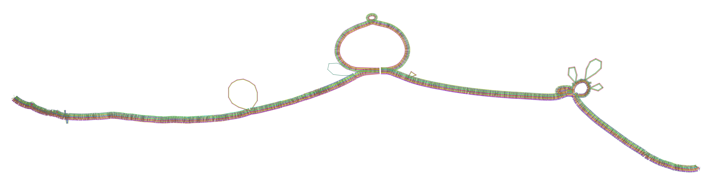

.. _quick_start:

===========
Quick Start
===========

.. toctree::
    :maxdepth: 1

A pangenome models the full set of genomic elements in a given species or clade. It can efficiently be encoded in the
form of a variation graph, a type of sequence graph that embeds the linear sequences as paths in the graphs themselves.

To exchange pangenomes, the community frequently uses a strict subset of the Graphical Fragment Assembly ``GFA`` format
version 1 (`GFAv1 <https://www.ncbi.nlm.nih.gov/pmc/articles/PMC8006571/#FN8>`_).

In the following, a generic quick start guide for the ``pggb`` pipeline is described.
The input is a FASTA file (e.g. ``input.fa``) containing all sequences to build a pangenome graph from.

-----------------------------
Step 1 - Sequence Preparation
-----------------------------

Put your sequences in one FASTA file ``in.fa``, optioanlli compress it with ``bgzip``, and index it with ``samtools faidx in.fa`` (or ``samtools faidx in.fa.gz`` for compressed input).
If you have many samples and/or haplotypes, we suggest using the `PanSN-spec <https://github.com/pangenome/PanSN-spec>`_ naming pattern.

-----------------------
Step 2 - Sequence partitioning (OPTIONAL)
-----------------------

If you have whole-genome assemblies, you might consider partitioning your sequences into communities, which usually correspond to the different chromosomes of the genomes.
Then, you can run ``pggb`` on each community (set of sequences) independently (see :ref:`partition_before_pggb`).

-----------------------
Step 3 - Graph Building
-----------------------

To build a graph from a 9-haplotype ``in.fa``, in the directory ``output``, scaffolding the graph using 5kb matches at >= 90% identity, and using 16 parallel threads for processing, execute:

.. code-block:: bash

    pggb \
    -i in.fa \       # input file in FASTA format
    -o output \      # output directory
    -n 9  \          # number of haplotypes (optional with PanSN-spec)
    -t 16            # number of threads (defaults to ``getconf _NPROCESSORS_ONLN``)
    -p 90 \          # (default) minimum average nucleotide identity for a seed mapping
    -s 5000 \        # (default) segment length
    -V 'ref:1000'    # make a VCF against "ref" decomposing variants >1000bp

The final process output will be called ``outdir/input.fa*smooth.fix.gfa``.
By default, we render 1D and 2D visualizations of the graph with `odgi <https://doi.org/10.1093/bioinformatics/btac308>`_, which are very useful to understand the result of the build.

.. _partition_before_pggb:

partition before pggb
-----------------------------------------

In the above example, to partition your sequences into communities, execute:

.. code-block:: bash

    partition-before-pggb -i in.fa \       # input file in FASTA format
                          -o output \      # output directory
                          -n 9 \           # number of haplotypes (optional with PanSN-spec)
                          -t 16 \          # number of threads
                          -p 90 \          # minimum average nucleotide identity for segments
                          -s 5k \          # segment length for scaffolding the graph
                          -V 'ref:1000'    # make a VCF against "ref" decomposing variants >1000bp

This generates the command lines to run ``pggb`` on each community (2 in this example) independently:

.. code-block:: bash

    pggb -i output/in.fa.dd9e519.community.0.fa \
         -o output/in.fa.dd9e519.community.0.fa.out \
         -p 5k -l 25000 -p 90 -n 9 -K 19 -F 0.001 \
         -k 19 -f 0 -B 10000000 \
         -H 9 -j 0 -e 0 -G 700,900,1100 -P 1,19,39,3,81,1 -O 0.001 -d 100 -Q Consensus_ \
         -V ref:1000 --threads 16 --poa-threads 16
    pggb -i output/in.fa.dd9e519.community.1.fa \
         -o output/in.fa.dd9e519.community.1.fa.out \
         -p 5k -l 25000 -p 90 -n 9 -K 19 -F 0.001 \
         -k 19 -f 0 -B 10000000 \
         -H 9 -j 0 -e 0 -G 700,900,1100 -P 1,19,39,3,81,1 -O 0.001 -d 100 -Q Consensus_ \
         -V ref:1000 --threads 16 --poa-threads 16

See also the :ref:`sequence_partitioning` tutorial for more information.

.. _quick_start_example:

-----------------------------------------
Example - Building an MHC Pangenome Graph
-----------------------------------------

We build a MHC class II ALTs GRCh38 pangenome graph from 10 haplotypes using test data from this repository's ``data/HLA`` directory.

.. code-block:: bash

    git clone --recursive https://github.com/pangenome/pggb
    cd pggb
    ./pggb -i data/HLA/DRB1-3123.fa.gz -p 70 -s 3000 -n 10 -t 16 -V 'gi|568815561' -o out

..
    This writes to directory ``out``: a variation graph in GFA format, a multiple sequence alignment in MAF format, a series of consensus graphs at different levels of variant resolution,

This writes to directory ``out``: a variation graph in GFA format, a multiple sequence alignment in MAF format,
and several diagnostic images. By default, the outputs are named according to the input file and a hash of the construction parameters.
Adding -v prohibits the rendering of 1D and 2D diagnostic images of the graph. This can reduce running time, because the calculation of the 2D layout can take a while. 
By default, redundant structures in the graph are collapsed by applying GFAffix. We also call variants with ``-V`` with respect to the reference ``gi|568815561``.

----------------------
1D Graph Visualization
----------------------

.. image:: ../img/DRB1-3123.fa.gz.pggb-E-s5000-l15000-p80-n10-a0-K16-k8-w50000-j5000-e5000-I0-R0-N.smooth.og.viz_mqc.png

Explanation of this 1D visualization:

    - The graph nodes are arranged from left to right forming the pangenome sequence.
    - The colored bars represent the binned, linearized renderings of the embedded paths versus this pangenome sequence in a binary matrix.
    - The path names are visualized on the left.
    - The black lines under the paths, so called links, represent the topology of the graph.

----------------------
2D Graph Visualization
----------------------

Explanation of this 2D visualization:

    - Each colored rectangle represents a node of a path. The node’s x-coordinates are on the x-axis and the y-coordinates are on the y-axis, respectively.
    - A bubble indicates that here some paths have a diverging sequence or it can represent a repeat region.

For more information about the layout, please visit https://odgi.readthedocs.io/en/latest/rst/tutorials/sort_layout.html.
