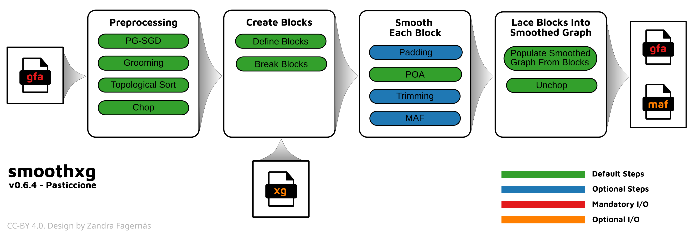

.. _smoothxg:

########
smoothxg
########

.. toctree::
    :maxdepth: 1

With `smoothxg <https://github.com/pangenome/smoothxg>`_,  the graph is sorted with a form of multi-dimensional scaling in 1D, groomed, 
topologically ordered locally, and chopped. The 1D order is then broken into "blocks" which are "smoothed" using the partial order alignment (POA) algorithm 
implemented in `abPOA <https://github.com/yangao07/abPOA>`_ or `spoa <https://github.com/rvaser/spoa>`_. This normalizes their mutual alignment 
and removes artifacts resulting from transitive ambiguities in the pairwise alignments. It ensures that the graph always has local partial order, 
which is essential for many applications and matches our prior expectations about small-scale variation in genomes.
Populating a rebuilt graph from the blocks we also get a whole genome alignment in `MAF <http://www.bx.psu.edu/~dcking/man/maf.xhtml>`_ format.

..
    This step yields a rebuilt graph, a consensus subgraph, and a whole genome alignment in `MAF <http://www.bx.psu.edu/~dcking/man/maf.xhtml>`_ format.
